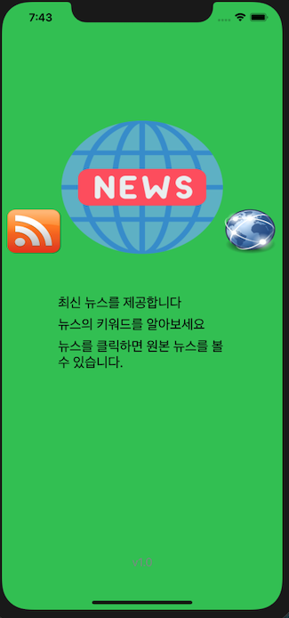
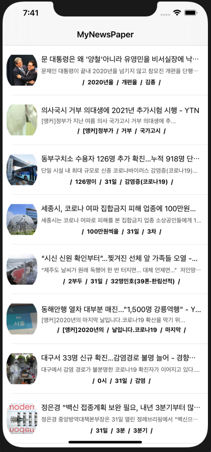
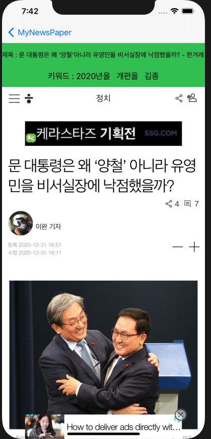

## [RSS 뉴스 리더 어플리케이션]
- 1.진행 기간: 2020.03.16 ~ 2020.04.03
- 2.주요 내용 : 구글 뉴스 RSS를 이용하여 썸네일과 기사 본문, 기사 키워드를 추출하여 테이블뷰로 보여주는 어플입니다.
- 3.본인이 공헌한 점 : 개인 프로젝트로서 앱 설계부터 구현까지 모두 스스로 개발하였습니다. 
- 4.사용한 Skill 또는 지식 : RSS에서 기사 제목과 URL을 추출하는 XMLParserDelegate 와 URL을 통해 기사 본문과 썸네일을 읽어 들이기 위하여 SwiftSoup 라이브러리와 webKit를 이용하였습니다. 메모리를 효율적으로 사용하기 위하여 dataTask와 dispatch Queue를 이용하였습니다.
- 5.결과/성과 :MVVM 패턴을 공부하면서 만들어본 어플이였지만, 패턴 이해의 미숙으로 난해한 구조로 만들어지게 되었습니다. 하지만, XML과 자바스크립트를 가공하여 원하는 데이터를 갖고 올 수 있는 iOS앱을 만드는 좋은 기회였습니다.

## ■ 앱 실행 이미지

<figure> 

<figcaption>⬅︎ 메인 화면</figcaption>
</figure>
  <figure>

<figcaption>⬅︎ 뉴스 테이블</figcaption>
    </figure>
      <figure>

<figcaption>⬅︎ 뉴스 화면</figcaption>
        </figure>

